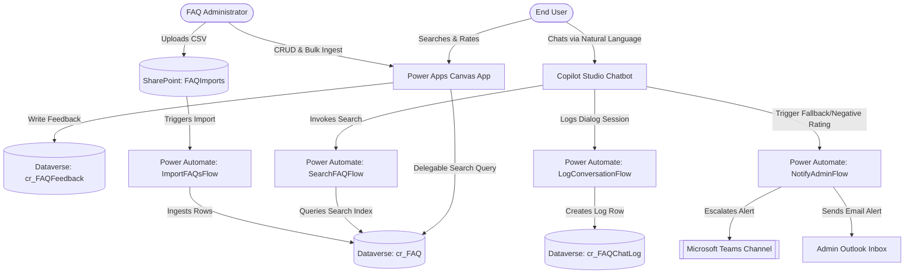

# Enterprise FAQ Copilot

Welcome to the **Enterprise FAQ Copilot** repository. This solution provides a production-ready, AI-powered knowledge base designed to serve 3,000–4,000+ FAQ records to over 50+ concurrent users with sub-2-second search times. 

It is built on the Microsoft Power Platform stack, utilizing **Microsoft Dataverse**, **Power Apps (Canvas App)**, **Microsoft Copilot Studio (Power Virtual Agents)**, and **Power Automate**.

---

## 🏛️ System Architecture

The following diagram illustrates how the components interact in this solution:

---

## 📂 Repository Folder Structure

Click on any file path below to view the source code and configuration definitions:

-   **📁 Data & Generators**
    -   [`data/generate_sample_data.py`](file:///Users/raiyankhan/.gemini/antigravity/scratch/enterprise-faq-copilot/data/generate_sample_data.py): Python script to generate the 4,000 unique records.
    -   [`data/sample_faqs.csv`](file:///Users/raiyankhan/.gemini/antigravity/scratch/enterprise-faq-copilot/data/sample_faqs.csv): Generated CSV dataset ready for Dataverse ingestion.
-   **📁 Database Schema (Dataverse XML)**
    -   [`database/cr_FAQCategory.xml`](file:///Users/raiyankhan/.gemini/antigravity/scratch/enterprise-faq-copilot/database/cr_FAQCategory.xml): Categories and self-referencing subcategory definitions.
    -   [`database/cr_FAQ.xml`](file:///Users/raiyankhan/.gemini/antigravity/scratch/enterprise-faq-copilot/database/cr_FAQ.xml): FAQ core question, answer, status, and priority mappings.
    -   [`database/cr_FAQFeedback.xml`](file:///Users/raiyankhan/.gemini/antigravity/scratch/enterprise-faq-copilot/database/cr_FAQFeedback.xml): Helpfulness ratings and user comment logs.
    -   [`database/cr_FAQChatLog.xml`](file:///Users/raiyankhan/.gemini/antigravity/scratch/enterprise-faq-copilot/database/cr_FAQChatLog.xml): Chat transcripts and confidence scores log.
-   **📁 Power Apps Canvas App Source**
    -   [`powerapps/src/App.fx.yaml`](file:///Users/raiyankhan/.gemini/antigravity/scratch/enterprise-faq-copilot/powerapps/src/App.fx.yaml): Startup initialization and design variables.
    -   [`powerapps/src/UserPortalScreen.fx.yaml`](file:///Users/raiyankhan/.gemini/antigravity/scratch/enterprise-faq-copilot/powerapps/src/UserPortalScreen.fx.yaml): Portal Search, Recents, and Favorites gallery layout.
    -   [`powerapps/src/FAQDetailsScreen.fx.yaml`](file:///Users/raiyankhan/.gemini/antigravity/scratch/enterprise-faq-copilot/powerapps/src/FAQDetailsScreen.fx.yaml): Detailed HTML answer view, helpfulness ratings panel, and related items.
    -   [`powerapps/src/AdminDashboardScreen.fx.yaml`](file:///Users/raiyankhan/.gemini/antigravity/scratch/enterprise-faq-copilot/powerapps/src/AdminDashboardScreen.fx.yaml): CRUD operations management form and CSV export features.
    -   [`powerapps/formulas.md`](file:///Users/raiyankhan/.gemini/antigravity/scratch/enterprise-faq-copilot/powerapps/formulas.md): Reference guide for all Power Fx syntax and delegation strategies.
-   **📁 Copilot Studio Dialog Topics (YAML)**
    -   [`copilot-studio/SearchFAQTopic.yaml`](file:///Users/raiyankhan/.gemini/antigravity/scratch/enterprise-faq-copilot/copilot-studio/SearchFAQTopic.yaml): Custom search intent dialog with low confidence thresholds.
    -   [`copilot-studio/FallbackTopic.yaml`](file:///Users/raiyankhan/.gemini/antigravity/scratch/enterprise-faq-copilot/copilot-studio/FallbackTopic.yaml): Low-confidence escalation routing and fallback handling.
    -   [`copilot-studio/SuggestRelatedFAQs.yaml`](file:///Users/raiyankhan/.gemini/antigravity/scratch/enterprise-faq-copilot/copilot-studio/SuggestRelatedFAQs.yaml): Dialog component for prompting contextually related questions.
-   **📁 Power Automate Flow JSON definitions**
    -   [`power-automate/ImportFAQsFlow.json`](file:///Users/raiyankhan/.gemini/antigravity/scratch/enterprise-faq-copilot/power-automate/ImportFAQsFlow.json): Asynchronous CSV parser and Dataverse table ingester.
    -   [`power-automate/NotifyAdminFlow.json`](file:///Users/raiyankhan/.gemini/antigravity/scratch/enterprise-faq-copilot/power-automate/NotifyAdminFlow.json): Outlook and Teams adaptive card broadcast notifier.
    -   [`power-automate/LogConversationFlow.json`](file:///Users/raiyankhan/.gemini/antigravity/scratch/enterprise-faq-copilot/power-automate/LogConversationFlow.json): Chat statistics and NLU metrics logging flow.
    -   [`power-automate/StoreFeedbackFlow.json`](file:///Users/raiyankhan/.gemini/antigravity/scratch/enterprise-faq-copilot/power-automate/StoreFeedbackFlow.json): Logs helpfulness ratings for analytics dashboards.
-   **📁 Deployment and Testing Guides**
    -   [`deployment/solution_manifest.xml`](file:///Users/raiyankhan/.gemini/antigravity/scratch/enterprise-faq-copilot/deployment/solution_manifest.xml): Official Power Platform Solution XML packaging specification.
    -   [`deployment/deployment_guide.md`](file:///Users/raiyankhan/.gemini/antigravity/scratch/enterprise-faq-copilot/deployment/deployment_guide.md): Setup instructions, role assignments, and solution imports.
    -   [`tests/test_scenarios.md`](file:///Users/raiyankhan/.gemini/antigravity/scratch/enterprise-faq-copilot/tests/test_scenarios.md): Quality assurance check-lists, RBAC controls validation, and load-testing configurations.
-   **📁 Netlify Web Portal Hub**
    -   [`web/index.html`](file:///Users/raiyankhan/.gemini/antigravity/scratch/enterprise-faq-copilot/web/index.html): Responsive dashboard HTML with local search and connection configurations.
    -   [`web/style.css`](file:///Users/raiyankhan/.gemini/antigravity/scratch/enterprise-faq-copilot/web/style.css): Premium glassmorphic styling, custom scrollbars, and dark slate colors.
    -   [`web/app.js`](file:///Users/raiyankhan/.gemini/antigravity/scratch/enterprise-faq-copilot/web/app.js): Handles filtering logic, tab switching, and Bot Framework Web Chat connection hooks.
    -   [`web/sample_faqs.json`](file:///Users/raiyankhan/.gemini/antigravity/scratch/enterprise-faq-copilot/web/sample_faqs.json): Simulated local search FAQ records.
    -   [`web/netlify.toml`](file:///Users/raiyankhan/.gemini/antigravity/scratch/enterprise-faq-copilot/web/netlify.toml): Netlify build parameters and security header configurations.

---

## ⚡ Architectural Best Practices Implemented

1.  **Delegation-First Querying:** Bypassed the 2,000 Canvas App record limit by wrapping lookups inside Dataverse-native `Search` and delegable relational filters (`=`). Substring searches (`in`) are deliberately avoided in critical paths.
2.  **Zero-Latency Client Caching:** Utilized `SaveData` and `LoadData` to store recent searches and bookmarked FAQs locally in the user's sandbox profile, ensuring instant load times and offline accessibility.
3.  **Real-Time Administration Alerts:** Triggered Power Automate flows asynchronously in the background when low-quality feedback is received, posting to Teams channels via Adaptive Cards without blocking the user UI.
4.  **Generative AI Fallback:** Configured Copilot Studio triggers to use generative fallback to handle conversational variation and automatically escalate missing topics to the Admin dashboard.
